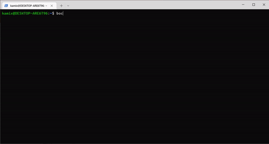

# Bocchi

terminal commend `bocchi` will show bocchi chan color block

## demo

## Usage

### Requirement

- rust runtime
- cargo

### Run

`cargo run`

### Build

run `cargo build` and you will find `bocchi` binary in target/release/